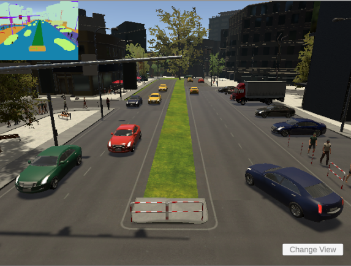
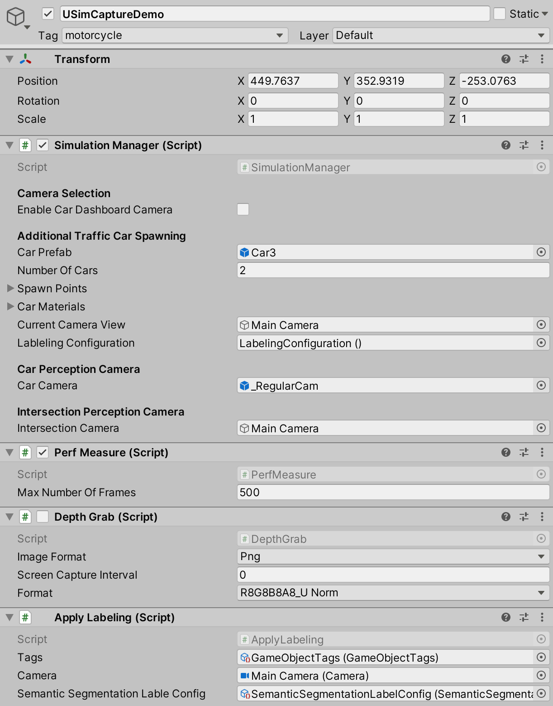
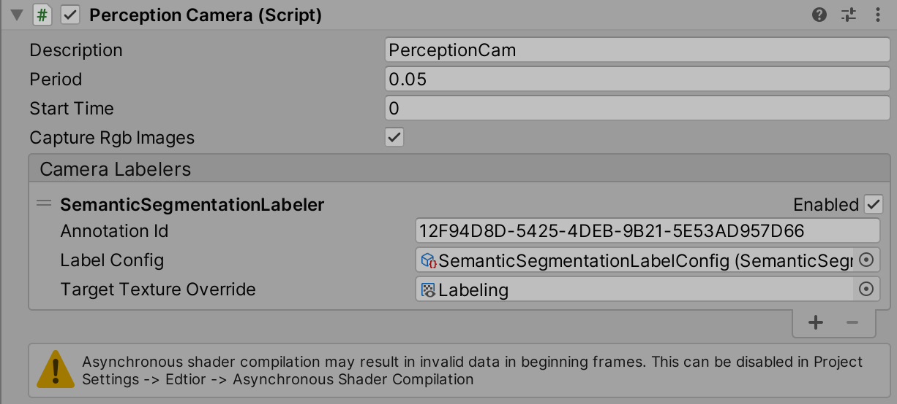
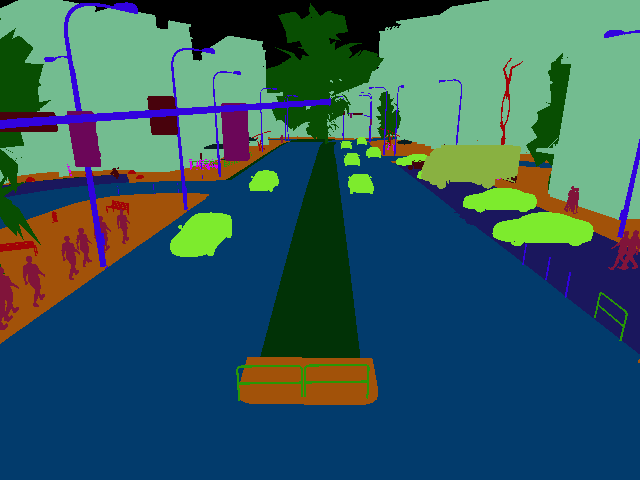
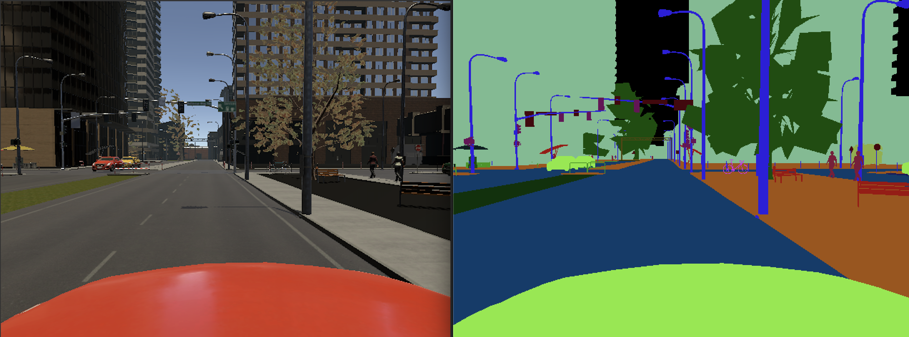
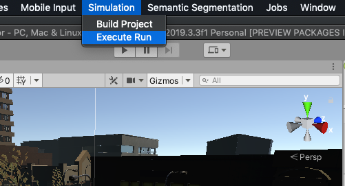

 
# Unity Simulation Sample Project
 
## Windridge 
#### Rendering Pipeline : Universal Rendering Pipeline
 
This sample project demonstrates the usage of Perception SDK for RGB images, Depth capture, Semantic segmentation and Data Logs and running it on USim at scale to generate a dataset that can be used for training a machine learning model.
 
### About Project
 
Category : Smart Cameras
 
This project exemplifies a general way of capturing synthetic data for any simulation. This approach can be applied to any other use case.
The scene setup comprises a predefined waypoint system for cars to drive around the city, a waypoint system for people to walk and other environment objects. There are two cameras setup one at the intersection to visualize the traffic and another one on the dashboard of one of the cars moving around the city.
 

### Components
 
 #### USimCaptureDemo
This object is responsible for driving the simulation.

 
#### PerceptionCamera 
This component enables capture of RGB images, Semantic segmentation and Bounding box annotations for the source camera on which this script is added. In this case the PerceptionCamera script component is added to the intersection camera and the car dashboard camera. You can choose the view for which you want to generate the dataset by selecting the camera view option on USimDataCaptureDemo game object (discussed later).
 

 
Detailed Documentation on Perception package can be found [here].(https://docs.unity3d.com/Packages/com.unity.perception@0.2/manual/index.html)
 
#### DepthGrab
This component captures depth for the dashboard camera of one of the cars. This component is enabled when the dashboard camera is enabled.
 
#### Perf Measure
This component keeps track of the number of frames generated and provides an FPS measure at the end based on total wall time elapsed.
 

 
### Switch Camera View
 
You can switch the camera view to car dashboard camera view by checking the Enable Car Dashboard Camera option on SimulationManager Script Component. This will enable the perception camera component on one of the Cars in the scene.
 

 
 
## Run on USim
 In order to run your simulation on USim, you will have to sign up for the service by visiting our [website](https://unity.com/products/unity-simulation)
 
You can run your simulation on USim using the USim CLI by following instructions [here](https://github.com/Unity-Technologies/Unity-Simulation-Docs/blob/master/doc/cli.md), or you can use simulation client package which exposes C# APIs to automate USim CLI workflow in Unity Editor as per your requirement, to improve iteration time. This project demonstrates usage of Client package APIs by creating a menu item, which provides options to Build Project and Execute on USim. Build Project will perform a Linux Standalone build and zip it up for upload. Execute menu item will create a run definition to run the simulation with the build generated using vCPU6 sysparam and schedule it on USim. After the run is scheduled, it will log the execution-id to the console. Make sure you are logged in to Unity Services and your project is linked to a cloudprojectId.

 

 
 
#### Parameterization
This is one of the important aspects of running the simulation to generate a variety of dataset.
The project is set up with a few SimulationOptions
- MaxNumberOfCars
- MaxNumberOfFramesToCapture
- EnableCapturingDrivingLogs
- EnableDepthCamera
- CameraViewToCapture
- TimeOfDay
- Light Intensity
 
You can set different appParams with these options and run the desired number of instances against each appParam. The simulation config is parsed on RuntimeInitializeOnLoad and applied to the simulation configuration.
 
#### How to extend this project
This project can be extended to simulate smart cameras at a traffic intersection. The waypoint system and car physics can be modified to generate different scenarios to generate data sets.
 
### Limitations and known issues
Limitations
- The current waypoints system supports upto 20 cars. 
- The waypoint system is not configurable. 
- Car physics uses a single raycast to account for cars in the front. It does not account for cars in the blind spot.
 
#### Known Issues
Depth Grab bundled with this project has issues and will be fixed in the next update.
 
 
## FAQs
 
**1. Execute menu option doesn't work for me**
 
     This might typically happen if you are not logged in or linked your project. You can do this by opening the Service window (Cmd + 0 or Ctrl + 0) and clicking on SignIn and link your project.
 
 
**2. I am logged in and my project is linked, I am still not able to run on USim**
 
    This might happen if you have not signed up for the Unity Simulation Service.
 
 
**3. What scene to load?**
 
     Try searching for CityScene in the Project.
 
 

